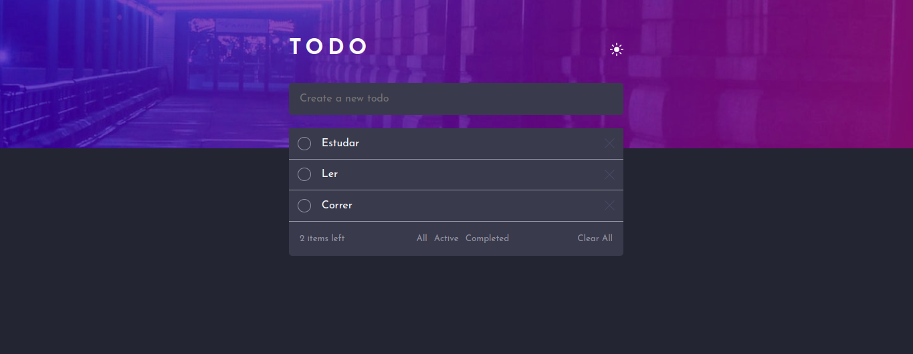

# Projeto Todo APP


## Tabela de conteúdos

- [Visão geral](#visão-geral)
  - [Projeto](#projeto)
  - [Screenshot](#screenshot)
  - [Links](#links)
- [Meu processo](#meu-processo)
  - [Built with](#built-with)
  - [What I learned](#what-i-learned)
  - 


## Visão Geral

### Projeto

Usuários estão aptos a:

- Ver hover states para todos elementos interativos do app
- Adicionar novos tarefas para lista
- Mudar o estado das tarefas Active ou Completed
- Ver a quantidade de tarefas restantes que podem ser adicionadas
- Deletar todas as tarefas
- Filtrar por all/active/complete 
- Mudar o tema do app para o modo light ou dark 

### Screenshot




### Links

- Código do projeto: [https://github.com/Phses/Todo_APP]
- Live Site URL: [https://wonderful-salamander-3d1111.netlify.app/]

## Meu processo

### Construído com

- HTML 5 semântico 
- CSS Sass e padrão BEM
- Flexbox
- CSS Grid
- Vanilla JS

### Maiores desafios

Este é o meu primeiro projeto usando local storage, salvei os dados referentes às tarefas e o último tema utilizado pelo usuário, permitindo que o usuário sempre veja a UI com suas tarefas criadas e com o tema preferido.

A parte do checkbox também foi bastante desafiadora.

```html
<input type="checkbox" class="task-list__checkbox" name="task" unchecked> 
//checkmark é quem será estilizado pelo css, já que por padrão não conseguimos estilizar o checkbox default
<span class="checkmark"></span>`
```
```css
      .checkmark {
        background-color: $bg-light;
      }
      //Quando o checkbox muda o estado para check, mudamos o estilo do checkmark, que é quem esta sendo estilizado
      input:checked ~.checkmark {
        background: $checked-button-color !important;
        z-index: -20;
      }
      input:hover ~.checkmark {
        border-color: hsl(235, 21%, 11%);
      }
      .checkmark {
        position: relative;
        height: 20px;
        width: 20px;
        border: 1px solid $soft-grey-color;
        border-radius: 50%;
        //Adicionando icone check
        &::after {
          content: "";
          position: absolute;
          top: 4px;
          right: 4px;
          width: 10px;
          height: 10px;
          background: url(../images/icon-check.svg) no-repeat center center/cover;
          z-index: -10;
        }
      }
      //Alterando o checkbox default para que ele não seja visivel, mas clicavel
      .task-list__checkbox {
        position: absolute;
        height: 20px;
        width: 20px;
        top: 0.8rem;
        left: 0.8rem;
        border-radius: 50%;
        opacity: 0;
        cursor: pointer;
        z-index: 10;
      }
```
```js
//Funções criadas que lidam com o localStorage
function saveTaskLocalStorage(task) {
  let tasks;
  if (localStorage.getItem('tasks') === null) {
    tasks = [];
  } else {
    tasks = JSON.parse(localStorage.getItem('tasks'));
  }
  //Adiciona a tarefa criada ao array tasks
  tasks.push(task);
  localStorage.setItem('tasks', JSON.stringify(tasks));
}

function removeTaskLocalStorage(task) {
  let tasks = [];
  if (localStorage.getItem('tasks') === null) {
    tasks = [];
  } else {
    tasks = JSON.parse(localStorage.getItem('tasks'));
  }
  //indexOF retorna o índice de task no array tasks e salva na variável index
  let index = tasks.indexOf(task);
  //método splice recebe o índice da tarefa que queremos excluir o número de itens do array que queremos excluir a partir daquele índice.
  tasks.splice(index, 1);
  //Salvamos no localStorage o array tasks após excluirmos a tarefa
  localStorage.setItem('tasks', JSON.stringify(tasks));
}
```
